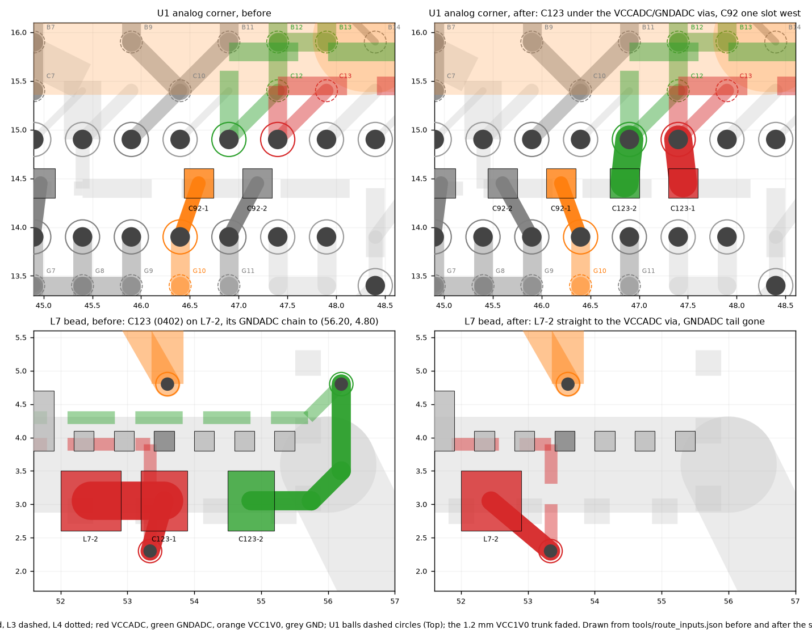

# C123 moves to U1's analog balls: placed 2026-09-16

**Status: ECO APPLIED, PLACED, SAVED, DRC UNCHANGED FROM STAGE 2, VERIFIED FROM THE SAVED FILE.**

- Schematic side: `tools/c123_to_0201.py` (commit f2ddd8f).
- Board side: `tools/c123_plan.py` writes `tools/c123_placement.json` and `tools/c123_route.json`.
- Procedures in `tools/ZuluSetup.pas`: `PlaceC123Move` / `RestoreC123Move` and `PlaceC123Copper` / `RemoveC123Copper`.
- Picture: `tools/c123_plot.py`.

## Why

Xilinx UG480 Figure 6-1 (on-chip reference) feeds VCCADC from VCCAUX through a ferrite bead. It puts
a 470 nF at the bead and a 100 nF at the package. Note 1 says the 100 nF goes as close as possible
to the package balls.

On this board both capacitors sat at the bead, L7:
- C124 (470 nF) was where the figure puts it;
- C123 (100 nF) was 27.8 mm (VCCADC) and 31.7 mm (GNDADC) of analog pair away from U1.

Your decision: C123 becomes the stocked 0201 100 nF (GRM033R61A104KE15D, already on 11 positions) and
moves to the balls. C124 stays.

## What changed

| Step | Change | Verified |
|---|---|---|
| Schematic | C123: C-USC0402 → C-USC0201, footprint C0402 → C0201, MANF# and SPEC | f2ddd8f; BOM regenerated |
| ECO | 3 changes applied (design item, footprint, parameters). **11 others were refused**: the ECO also proposed removing 10 PCB net classes (CFG_FLASH … USB_DATA) and the USB differential pair, which exist only on the PCB side. | The saved board equals the planning model (C123 an 0201 in place, same nets). Only C123's two pads changed. |
| Placement | C92 (VCC1V0 0201) moves one slot west and turns 180°. C123 turns 180° and lands on Bottom directly under the GNDADC via (46.90, 14.90) and the VCCADC via (47.40, 14.90). Both designators are hidden. | C123-1 (47.45, 14.45) VCCADC, C123-2 (46.85, 14.45) GNDADC; C92-1 (46.20, 14.45) VCC1V0, C92-2 (45.60, 14.45) GND; PATTERN C0201, ROTATION 180, NAMEON FALSE in Components6 |
| Copper added | 5 Bottom tracks: C123-1 and C123-2 to their vias at 0.30 mm; C92's two ties at 0.15 mm, the board's practice for under-die 0201s; L7-2 → VCCADC via (53.34, 2.30) at 0.30 mm | |
| Copper removed | 1 via and 10 tracks: C92's old ties; C123-1's two stubs at the bead; C123-2's Bottom chain to the GNDADC via (56.20, 4.80), that via, and the L3 GNDADC tail (48.35, 5.00)–(48.85, 4.30)–(55.70, 4.30)–(56.20, 4.80) that existed only to reach it | vias 229 → 228, tracks 1133 → 1128 |

## The loop, measured on the saved board

The loop runs from the capacitor pads to the balls, via by via. The via barrel is 1.615 mm, Bottom to Top.
Inductance uses the Neumann free-space model with a 0.05 mm radius, the same harness that scored the candidates.

| | VCCADC C123-1 → U1-C13 | GNDADC U1-C12 → C123-2 | Loop area \|A\| | L |
|---|---|---|---|---|
| Before (0402 at the bead) | 27.802 mm: Bottom 0.779, via, L3 24.700, via, Top 0.707 | 31.716 mm: Top 0.707, via, L3 26.558, via, Bottom 2.836 | 13.379 mm² | 26.47 nH |
| **After** | **2.775 mm**: Bottom 0.453, via 1.615, Top 0.707 | **2.775 mm**: Top 0.707, via 1.615, Bottom 0.453 | **0.949 mm²** | **2.45 nH** |

That is 10.8× less inductance and 14.1× less area. VCCADC and GNDADC each stay one island.

**C92's own loop**, from C92-1 → U1-G10 and C92-2 → nearest GND ball, before and after:

| | Area | Inductance | Pad to ball | GND ball |
|---|---|---|---|---|
| Before | 0.414 mm² | 3.308 nH | VCC1V0 2.697 mm, GND 2.737 mm | G11 |
| After | 0.430 mm² | 3.313 nH | VCC1V0 2.701 mm, GND 2.742 mm | G9 |

## How it was chosen

Three planners wrote complete plans. Each plan went to a PI/analog reviewer and a manufacturing/next-stages
reviewer, then a judge:

| Plan | Idea | Loop | New vias |
|---|---|---|---|
| bestloop | C123 north of the land field | 4.92 nH / 1.198 mm² | 2 |
| pairdrop | C123 north of the land field at (49.78, 17.24), on L4 around the D15 via | 5.03 nH / 1.264 mm² | 2 |
| **undervias** | **C123 under its own fan-out vias, C92 mirrored one slot west** | **2.45 nH / 0.949 mm²** | **0** |

- **The judge picked pairdrop.** Undervias had failed gates 1 (placement legality) and 4 (merged reach).
- **Both failures were a tool bug, not the plan.** `block_place.py` tested the moved pads against
  C92's old ties, copper the same plan removes. The gaps were 0.023–0.035 mm, and those tracks are deleted
  in the same session, before DRC and save.
- **Both tools now apply a plan's `remove` list first.** `block_place.py` does it for legality and for
  `--merge-plan`, and `route_stitch.py` for the sites it counts. With that, undervias passes every gate.
- **Undervias was adopted.** Reviewer scores: analog 8.5, manufacturing 7, no fatal findings.

## Gates (re-run in this session on the model, then on the saved board)

| Gate | Result |
|---|---|
| `block_place.py` with the plan (removals applied) | legal: land gaps ≥ 0.30, edge ≥ 0.30, no courtyard overlap, clear of existing copper |
| `route_emit.py --require-complete` | clean. 63/67 nets joined; the plan touches 3, all 3 joined. All 11 removals matched; every U1 power/GND ball still reaches its via. |
| `route_foreclosure.py` | none foreclosed; 5 nearby unowned pads audited, none foreclosed |
| `route_reach.py` (plan merged, then the saved board) | 264 / 264 |
| `route_stitch.py` | whole board 35692 → 35712 sites; U1 surround 3433 → 3433 |
| `route_width.py` VCC3V3 C80-2,L1-2 → U1-F17 | 0.175 mm before and after |
| `route_width.py` VCC3V3 → Bottom (40.4–41.4, 7–12) | 1.588 mm before and after |
| Foreign gaps under 0.12 mm created | none. The closest is 0.172 mm: the new stubs to the FPGA-CCLK and VCC3V3 vias. |
| `board_preflight.py` | PREFLIGHT CLEAN |

**Pad-to-via gaps.** C92's pads keep 0.129 mm to the foreign vias beside them (0.1275 / 0.1309 before).
C123's pads sit 0.125 mm from their own-net via lands, the same as C96 on this row today.

## DRC

`docs/drc_c123_2026-09-16.drc` has 442 violations:
- 369 un-routed;
- 2 waived plane thermals;
- 71 net antennae.

Every geometric rule is 0. **The violation set is identical, line for line, to stage 2's
`docs/drc_stage2_2026-09-16.drc`**: nothing new and nothing gone. The removed GNDADC tail left no antenna.

## Saved file

`route_inputs.json` rebuilt from the saved PcbDoc equals the plan's expected board (the moved model,
removals applied, plan copper merged):
- all 228 vias, all 1128 tracks (one stored in the other direction), and all top, bottom and
  through-hole pads match;
- the pad lists of all 67 nets match.

## Open

- No committed netlist file carries footprints, so none needed regenerating.
- The earlier open decisions are unchanged: solder mask 1:1 on small passives; the C144/C145 swap;
  via-in-pad under U8's thermal pad; the fan-out via at (51.40, 11.40), 0.04 mm from C111-2.
