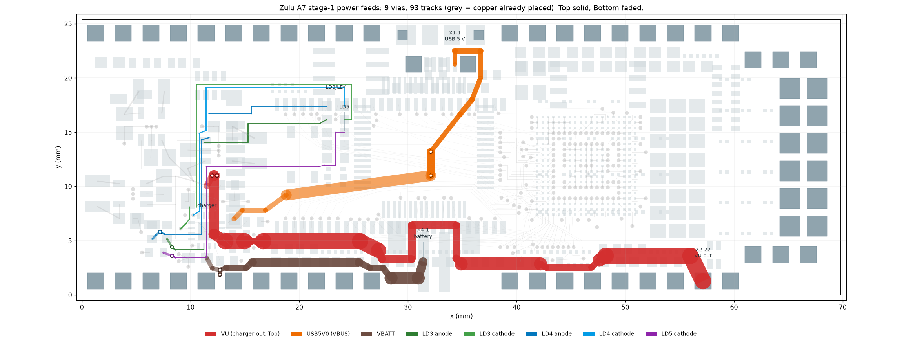

# Power feeds, stage 1: the charger's eight nets — placed 2026-09-16

**Status: PLACED, SAVED, DRC-CLEAN ON EVERY GEOMETRIC RULE, VERIFIED FROM THE SAVED FILE.**
`tools/stage1_plan.py` → `tools/stage1_route.json` (9 vias, 93 tracks, additions only);
`PlaceStage1` / `RemoveStage1` in `tools/ZuluSetup.pas`.



## What it finishes

| Net | Route | New copper | Vias |
|---|---|---|---|
| VU | the block → Top the whole way → X2-22 (57.150, 1.270) | 61.6 mm, 1.50 mm trunk necking to 0.55 only where it threads a via window | 2 (one layer change) |
| VBATT | C151-2 → Top above the header → X4-1 | 23.3 mm at 0.40–1.20 mm | 2 |
| USB5V0 | U8-13/C150-2 → Bottom across U3's belly → Top → X1-1 from the east | 37.8 mm at 0.40–1.00 mm | 2 |
| NetLD3_A / NetLD3_K / NetLD4_A / NetLD4_K / LD5_K | five stacked Top lanes between the X3 keep-out and X3's pads | 142 mm at 0.0762–0.20 mm | 3 (two reuse the escape vias placed with the block) |

No copper on L3-SIG or L4-SIG anywhere: both inner layers go to the next stage exactly as they were
found. Resistance, from a nodal solve over the plan plus the board's own copper: **VU 34.6 mΩ**
(24 mV at 0.70 A), USB5V0 31.4 mΩ (16 mV at 0.5 A), VBATT 17.0 mΩ.

## How it was chosen

Three strategies — **south** (south band), **north** (the empty northern band), **wide** (lowest
resistance at any cost) — each with its own generator and each passing all four gates; each attacked
by a power/EMI reviewer and a manufacturing/next-stages reviewer; then a judge.

- **north rejected**: its VBUS ran inside the only Top window the X1 → U2 USB pair can use. The
  window is 1.025 mm and 0.09 + 0.45 + s + 0.20 + 0.09 ≤ 1.025 leaves s ≤ 0.195 mm, so the pair
  could not be separated from the noisiest net the port carries. It also walled **both** inner
  layers at x 57.15 for 20.9 mm, with 14 un-routed nets east of it.
- **wide rejected**: it spent both inner layers and ran a column through the U1 escape field at
  0.0905 mm from a CHAN5 via, with 49 escapes still to place — for 2.2 mV at 0.70 A. It also hit a
  **tooling defect** (below).
- **south chosen and repaired.** As submitted it closed the 0.568 mm Bottom channel above the
  header, which is FT-VCORE's only escape from C139-2: `route_width` went 0.538 mm →
  **UNREACHABLE**. The arithmetic is closed (0.09 + w + 0.09 + 0.15 + 0.09 ≤ 0.568 needs
  w ≤ 0.148 mm, below VBATT's 0.20 mm minimum), so the judge swapped the two lanes: VU took the
  empty Top band at y ≈ 4.9 and VBATT took the lane above the header. That also removed both VBATT
  vias from inside X4's footprint, and turned four 0.120 mm gaps at the battery connector into
  0.200 mm. Cost: 2.8 mΩ on VU.

Other repairs: VU's neck under the AIN16_N link widened its clearances (0.120 → 0.195 mm); VBUS's
runs past the D12/D13 escape vias (0.125 → 0.210 mm); the NetLD4_A via moved out from under R108's
body, where a solder wick would have shorted VU to it; eleven through-hole pins at 0.118–0.152 mm
became one at 0.198 mm.

## Two gate defects this run exposed, both fixed

1. **`Remove<Block>` could delete committed copper.** `route_emit._trk_match` keyed a track on net,
   layer and endpoints but **not width**, so a plan track laid on an existing centreline to widen it
   would be deleted along with the new copper — on the "wide" plan the undo would have disconnected
   the charger output. Width is now part of the key, and `check()` refuses a plan that repeats an
   existing track end for end.
2. **`route_foreclosure` never re-counted SDRAM escapes** when given a plan (`and not e['sdram']`),
   leaving 32 of 82 unchecked. Removed; all 32 are re-counted and none is foreclosed.

Also: the five LED nets were not in `route_inputs.json`'s net list, so the completeness walk could
not see them. `route_inputs.py` now carries a CHARGER class (the five LED nets and R102–R106's
nets); the gate reports **59/66 joined, 8 touched, 8 joined**.

## The gates (all pass; the tightest numbers)

```
python tools/route_emit.py tools/stage1_route.json Stage1 --require-complete   # clean, 8/8 joined
python tools/route_foreclosure.py tools/stage1_route.json                      # none; 247 pads audited
python tools/route_reach.py tools/stage1_route.json                            # 284 / 284
python tools/route_width.py --net … --plans tools/stage1_route.json            # the corridor budget
```

Corridor budget after the plan (floor in brackets): VCC3V3 → X2-17 1.588 [1.00]; → **X3-4 1.062
[1.00]** (the tightest row, unchanged by the repair); → L3 north band 1.588 [1.05]; VCC1V8 → X2-18
1.588 [1.00]; → U1 Top 1.588 [1.00]; VCC1V0 → X2-19 1.588 [1.00]; → **U1 west on L3 1.588 [1.50]**;
→ U1 Bottom 1.588 [1.00]; USB_D_P and USB_D_N 0.539 each [0.45], the bare-board value. Beyond the
budget: FT-VCORE C139-2 → U2-12 0.538 → 0.500 (rule minimum 0.15); FT-VPHY, FT-VPLL, VCCADC
unchanged.

## Verification

- **DRC** (`docs/drc_stage1_2026-09-16.drc`): **469 = 392 un-routed + 2 waived X2-20 thermals + 75
  net antennae**; zero on all three Clearance rules, Short-Circuit, all seven Width rules, the via
  plane connect, hole size, hole-to-hole, mask sliver, both silk rules and height. Un-routed fell
  400 → 392, exactly the eight connections this stage owns; antennae 77 → 75 as the two LED escape
  vias joined their nets.
- **Saved file**: vias 208 → 217, tracks 927 → 1020 — exactly the plan's 9 vias (all 0.20/0.35) and
  93 tracks, nothing removed, every pad unchanged. `verify_widths.py` PASSes.

## Open, recorded rather than fixed

- **Plane voids**: the nine new vias each clear a 0.70 mm hole in both GND planes; VU's pair and
  VBATT's pair each merge into a ~0.70 × 1.14 mm slot. Check against the bucks' return paths before
  the planes are poured.
- **VU reaches X2-22 with no decoupling at the far end** — its only capacitors sit west of x 12, and
  it is the three bucks' input node. The schematic wants bulk plus 100 nF at the header pin; a
  routing stage cannot add parts.
- **Stitching moved**: the Top band x 12–28, y 4–7 keeps 3.9 % of its legal via sites (VU and VBATT
  now occupy it); board-wide 84.9 % remain. Narrowing VU to 1.20 mm between x 17 and 25 would open
  it for 0.66 mΩ if GND stitching needs it there.
- **VU crosses inside X4's pad envelope** at 0.150–0.200 mm from its pads — copper under a connector
  body that no optical inspection can see. The alternative lane (Bottom under X4) is the only escape
  for the VCC3V3 caps C4–C8 and was rejected for that reason.
- Three gaps remain at ~0.112–0.120 mm (LD5_K threading a 0.30 mm via slot, one LED lane pair):
  arithmetic maxima. **Scope teardrops to exclude them**, as for the AIN gaps.
- `route_reach` rasterises every net at 3 mil and cannot honour per-net Width rules — it is what
  cleared the FT-VCORE connection the unrepaired plan killed. For a power rail, use `route_width`.
