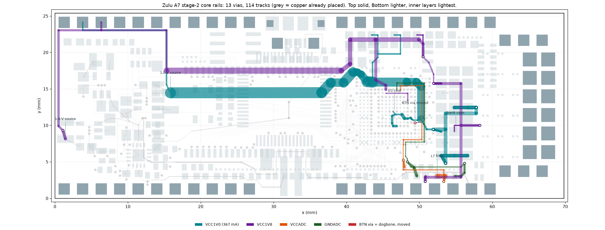

# Power feeds, stage 2: the core rails — placed 2026-09-16

**Status: PLACED, SAVED, DRC-CLEAN ON EVERY GEOMETRIC RULE, VERIFIED FROM THE SAVED FILE.**
`tools/stage2/gen.py` (with `lib.py`, `segw.py`) → `tools/stage2_route.json`: 13 vias, 114 tracks,
and one existing fan-out via moved. `PlaceStage2` / `RemoveStage2` in `tools/ZuluSetup.pas`.



## What it finishes

| Net | Connections closed | Route | Result at load |
|---|---|---|---|
| VCC1V0 | 10 | Bottom only, no layer change: L3-2 → 1.50 mm under U3's belly → over the SDRAM and GND via columns → U1's north strip inside the land field → down the east flank → one gate into the core island. The bank caps C140–C143/C85/C86 hang off three vias joined on L3 under the Top cap array. | **8.22 mV worst ball at 367 mA** (22.4 mΩ effective; target was 10 mV) |
| VCC1V8 | 7 | L3/L4 through the stitching dead zones, 0.30–0.80 mm; X2-18 via the north-west edge lane | 15.4 mV at 77 mA (0.9 %) |
| VCCADC + GNDADC | 3 + 3 | a tight pair on L3 over the L2 plane: C123 → C124 under VU's trunk (L2 between), one crossing of U1's south escape ring, then inside the land field to the balls | loops 6.82 mm² (C124 → U1) and 5.78 mm² (C123 → C124); 29.9 mm from the switch nodes; 0.056 nH from the VCC1V0 feed |

## The wall every planner hit, and how it was crossed without a rule change

All three planners found, independently, that **VCC1V0 cannot reach U1's core inside
`Width_PWR_VCC1V0` as the board stood**. The fan-out vias sit on a 0.5 mm lattice. Every way into the
core island threads between two 0.35 mm via lands 1.0 mm apart:
1.00 − 0.35 − 2 × 0.09 = **0.470 mm on L3/L4** against a 0.50 mm minimum. The limit is 0.140 mm on
Bottom (minimum 0.15) and 0.095 mm on Top (minimum 0.15). The main session re-derived the lattice
from `route_inputs.json`, and the judge re-measured it with a 5 µm distance-field flood.

Two remedies were weighed:
- **(a)** a scoped Width-rule neck, which would have needed your approval;
- **(b)** moving existing copper by the smallest amount that opens a legal gate.

**(b) closed it with one change: the BTN fan-out via moved 0.055 mm south**, from (49.4001, 10.400)
to (49.4001, 10.345), together with its 3 mil Top dogbone. That opens the Bottom gate between
C91-2's GND pad and the via from 0.140 to 0.195 mm; the neck is 0.175 mm, inside the rule.
- The via keeps 0.445 mm to FT-PWREN# (pitch rule 0.44) and 0.245 mm hole to hole (rule 0.20).
- BTN still reaches R85-2 at 0.56 mm.
- `route_emit` matched the removal exactly and confirmed every U1 power/GND ball still reaches its via.

## How it was chosen

Three strategies were tried:
- **inner north**: VCC1V0 on L3+L4 through the north band;
- **bottom direct**: outer layers only;
- **split**: separate feeds per load cluster.

Each was attacked by a power/analog and a manufacturing/next-stages reviewer, then judged. A network
outage killed the reviewers and the judge on the first run; they were re-run on the cached plans.

- **inner north rejected.**
  - Its 0.45 mm L4 core lanes needed a rule change.
  - It left 45 % of U1's surround stitching sites.
  - Only 37 of the 50 remaining U1 escapes could still hold a via at the same time.
  - It walled both inner layers along y 18.3.
  - VCC1V0 was 10.05 mV.
- **split rejected.** It never connected VCC1V0's load, and its lanes occupied the only doors a
  core feed could use.
- **bottom direct chosen and rebuilt segment by segment.** Its four problems were fixed:
  - the rule failure at the neck, by remedy (b);
  - the analog pair on L4 under the 367 mA feed, by moving the pair to L3;
  - 113 sub-0.12 mm gaps, now 4, all forced by the BGA gate;
  - U1-surround stitching at 76.4 %, now 80.8 %.

Along the way the trunk was widened (8.22 mV against its 9.31) and the in-field vias kept both inner
escape layers.

## Gates (re-run by the main session on the final plan; md5 544852ac…)

```
python tools/route_emit.py tools/stage2_route.json Stage2 --require-complete
    clean; 63/67 joined, 4 touched, 4 joined; removes 1 via + 1 track, every U1 power/GND ball still on a via
python tools/route_foreclosure.py tools/stage2_route.json      none foreclosed; 176 pads audited
python tools/route_reach.py tools/stage2_route.json            263 / 263 (BTN checked separately: 0.56 mm)
python tools/route_width.py ...                                all 13 corridor rows at their baselines
python tools/route_stitch.py tools/stage2_route.json           whole board 90.7 %, U1 surround 80.8 %, north band 99.8 %
```

## Verification

- **DRC** (`docs/drc_stage2_2026-09-16.drc`): **442 = 369 un-routed + 2 waived X2-20 thermals + 71
  net antennae**; zero on all three Clearance rules, Short-Circuit, all seven Width rules, the via
  plane connect, hole size, hole-to-hole, mask sliver, both silk rules and height. Un-routed fell
  392 → 369, exactly the 23 connections this stage owns (VCC1V0, VCC1V8, VCCADC and GNDADC now have
  none). Antennae fell 75 → 71 as fan-out stubs joined their rails.
- **Saved file**: vias 217 → 229, tracks 1020 → 1133 — exactly the plan's 13 vias (all 0.20/0.35,
  the moved BTN via among them) and 114 tracks. The only removals are the BTN via and its dogbone.
  Every pad is unchanged; `verify_widths.py` PASSes.

## What stage 3 (VCC3V3) inherits

- Every row of the corridor budget is at its baseline. VCC3V3 → X3-4 is 1.062 mm, still the
  tightest.
- Pads narrowed but not sealed (board → now, mm): U1-F17 0.562 → **0.175** (Top only — VCC3V3's
  3 mil Top neck is legal); U1-G12/G13/K12/K13/L12/L13/M12/M8/N8 0.525 → 0.463; C114-1 1.025 → 0.450;
  C112-1 0.863 → 0.463; C111-1 0.950 → 0.525; C102-1 1.588 → 0.663; C120-1 1.062 → 0.713.
- Nine in-field signal vias lost their Bottom escape layer (FPGA-TCK, FPGA-CCLK, SD-DAT0, CHAN4,
  CHAN11, CHAN9, CHAN6, JA3, CHAN5); all keep L3 and L4.

## Open, recorded rather than fixed

- **Solder-mask openings.** The pad mask expansion is 0.05 mm (1.9685 mil) everywhere but U1 and
  vias, so a track closer than 0.14 mm to a foreign pad leaves less than JLC's recommended 0.09 mm
  between the mask opening and the track.
  - The board had **37 such pairs before this stage**: C113 at 0.0902, U3's stubs at 0.0926, the
    XADC filter R12/R13/R16/R17 at 0.10–0.11 and others. This stage adds about 11.
  - The worst new ones: VCC1V0's neck 0.1017 mm from C91-2 (GND), 0.12 mm from C111-1/C114-1/C120-1,
    and VCC1V8's C144-1 feed 0.1245 mm between C144's and C145's terminals.
  - Decide at fab prep: set 1:1 mask on the small passives (as U1 already has), or accept JLC's CAM
    reducing the openings.
- **C144-1 is boxed in** by the Top cap array; its only feed runs between C144's and C145's pads.
  Swapping or rotating C144/C145 would remove it — a placement change for you to decide.
- **C124 (470 nF) is VCCADC's only decoupling near U1**, 17 mm of pair away. A 0201 across
  VCCADC/GNDADC at the fan-out vias (47.4, 14.9)/(46.9, 14.9) would need a schematic and placement
  change.
- **Teardrop exclusions**, all forced by the gate: BTN via to FT-PWREN# via 0.095 mm land to land;
  neck to BTN via 0.100; neck to C91-2 0.1017; neck entry to the VCC3V3 via (48.9, 10.4) 0.1178.
- Plane anti-pads merge for three via pairs: VCC1V8 (51.95, 15.75) with VCC3V3 (51.4, 15.9);
  the VCCADC/GNDADC pair at C124; BTN with FT-PWREN#.
- `tools/stage2/gen.py` must be re-run against the pre-stage-2 inputs
  (`git show 95319de:Zulu_Altrium/tools/route_inputs.json`, via `--inputs`); it refuses the placed board.
