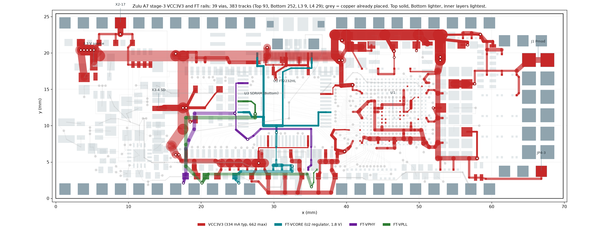

# Power feeds, stage 3: VCC3V3 and the FT2232H rails — placed 2026-09-21

**Status: PLACED, SAVED, DRC-CLEAN ON EVERY GEOMETRIC RULE, VERIFIED FROM THE SAVED FILE.**
`PlaceStage3` / `RemoveStage3` in `tools/ZuluSetup.pas`; placement record at the end.
`tools/stage3/gen.py --check` rebuilds `tools/stage3_route.json` (md5 d66640c94bad2697e8ec6005c28ef07c) from the nine
parts under `tools/stage3/parts/`: 39 vias, 383 tracks (Bottom 252, Top 93, L4 29, L3 9). Picture: `tools/stage3/render.py`.



## What it finishes

| Net | Connections closed | Route | Result at the datasheet maxima |
|---|---|---|---|
| VCC3V3 | 113 | five source vias at the block → a 1.50 mm **L4** spine along the north band (y 19.6, x 5–39) with a 1.50 mm L4 vertical at x 17.5 down to the south band; from x 39 a 1.50 mm **Top** run at y 22.5 east to x 53 and a 1.30 mm Bottom column down x 52.9 into U1's east side; seven regional taps; everything else on Top/Bottom | worst U1 VCCO ball 14.3 mV (limit 33), worst U3 pad 14.6 mV (33), U2 VREGIN 15.6 mV (50), SD card 9.8 mV, header corner 0.5 mV |
| FT-VCORE | 7 | VREGOUT pin 12 → a 0.30 mm Top ring under U2's body to pins 64 and 37, a 0.20 mm Top riser to pin 49; one via down to the 100 nF row (C152–C154) on Bottom and an L4 run to C139 | 0.7–1.3 mV at the VCORE pins; C139 is 58 mΩ / 29.5 mm from pin 12 (placement-limited) |
| FT-VPHY | 2 | bead L4 → an L4 slot at x 17.9 → y 11.7 → a 0.15 mm Top column into pin 4; C40 reached through U3's pocket | 3.4 mV at pin 4; C40 is 57 mΩ / 26 mm from the pin (placement-limited) |
| FT-VPLL | 2 | bead L5 → L3 at x 17.9 and y 11.1 → a Top hook into pin 9; C41 on the bead branch | 0.3 mV |

The drop numbers come from a nodal DC solve of the whole net (`parts/s3_trunk/drop.py`, reproduced independently by
the power-integrity reviewer): every track a resistor (outer 0.4914/w mΩ per mm, inner 1.1316/w), every via 1.606 mΩ,
the datasheet maxima sunk at the loads (667 mA in all: U2 VREGIN 70, FT-VPHY 60, U3 150 over seven pads, X3 200,
U1 VCCO 95 over 28 balls, U4 25, LEDs 22, pull-ups 8). Every inner-layer VCC3V3 segment is ≥ 1.05 mm (the rule's
inner minimum); no via sits inside U1's land field.

## How it was built

Two whole-board runs (three planners, 2026-09-16/17) each spent their budget exploring and never wrote a plan, so the
stage was split:

1. **Trunk.** Three designers (inner L4 trunk / outer only / ring) routed only the feed from the block to seven
   taps, one per region; two reviewers each; a judge chose the inner trunk and grafted the outer-only design's Top
   run at y 22.5 and Bottom column in place of an L4 spine north of U1 (which would have cost the 100 nF 0201s under
   U1's VCCO, U4-4 and U3-52/54 their GND via sites). Drops to the heavy taps: SD 9.5, south 10.7, north 11.8,
   U1 field 12.7 mV.
2. **Regions.** Seven agents in parallel — west (header corner), sdled (SD socket, BTN, LD5, pull-ups), north
   (U2's north/east pins, U3's north pads), south (the cap row, U3's south pads, U2's south pins, the beads),
   u1field (the 17 VCCO islands and twelve 0201s), northbank (the 0603 bank, Q1, U4), east — each closing its
   own pads from its tap with the trunk as base copper; the FT rails after the south region. Balls V1 and R1 are
   fed through U3-1 and one via south-west of U1 because the XADC bundle and the SDRAM escapes seal their fan-out
   vias on every layer.
3. **Merge, two reviews, final judge.** Seams fixed in the parts (recorded as `MERGE`/`JUDGE` notes in their gen.py);
   the judge's two repairs: the south channel bus moved from 0.30 to 0.48 mm off the routed outline, and
   FT-VPLL's via moved 0.10 mm east to keep a GND via slot for U2-10/11.

Rules the gates enforce that the first runs tripped over, now in the brief: copper joins **end to end only** (a
track ending on the middle of another is not a join), and no picture rendering. Shared helpers grew out of it:
`tools/stage3/corr.py` (widest corridor and via sites on route_width's raster), `merge.py`, `islands.py`
(which pads are joined to the source), and `Plan(base_plans=…)` in `lib.py`.

## Gates (re-run by the main session on `tools/stage3_route.json`)

```
python tools/route_emit.py tools/stage3_route.json Stage3 --require-complete
    clean; 67/67 joined, 4 touched, 4 joined
python tools/stage3/islands.py --net VCC3V3|FT-VCORE|FT-VPHY|FT-VPLL tools/stage3_route.json    one island each
python tools/route_foreclosure.py tools/stage3_route.json      none foreclosed; 275 pads audited
python tools/route_reach.py tools/stage3_route.json            140 / 140 (= 264 minus the 124 this stage owns)
python tools/route_width.py --net USB_D_P/USB_D_N ... --plans  0.539 mm both rows (floor 0.45)
python tools/route_stitch.py tools/stage3_route.json           whole board 75.3 %, block 92.8 %, north band 56.1 %, U1 surround 65.3 %
```

Stitching is over its floors by 123 sites (whole board) and 10 (U1 surround): any further copper in x 39–56,
y 5–23 must be re-run through `route_stitch`.

## Decisions recorded for the user

1. **GND via sites for C87, C88, C94, C106.** The Top run at y 22.5 leaves those bulk caps' GND pads no via site
   within 0.8 mm; the nearest are between X2's pins, ~1.1 mm away (a ~0.65 mm Bottom stub, ~0.5 nH on a 4.7 µF
   part). The alternative — the L4 spine north of U1 — costs the 100 nF 0201s under U1 their ties instead.
2. **0.12 mm to X2-4…9 and U4-7** from that run: legal; after JLC's mask expansion the dam is ~0.07 mm. No
   teardrops there.
3. **U2-20/31 feed: 7 mm of 0.145 mm Top at exactly 0.09 mm from X4-MP1**, the battery holder's hand-soldered tab.
   Either move X4 0.3 mm south (or shrink MP1's north edge) and re-cut that feed, or accept with a fab note.
4. **CORRECTED 2026-09-23 — U2's VCCIO/VREGIN pins are decoupled; the problem is distance, and X3-4 is the
   real gap.** The earlier wording here ("have no decoupling capacitor") was wrong, and so was any claim that
   U2's VCORE pins lack decoupling. From the files: `zulu_a7_4.SchDoc` (the FT2232H sheet) carries C38 and
   C133–C138, seven VCC3V3 capacitors, and FT-VCORE carries C152/C153/C154 (100 nF) on U2-12/37/64 plus C139
   (4.7 µF) — 8 pads on the net. What the geometry shows is placement: all seven VCC3V3 capacitors sit on
   Bottom along the y 3.95 row, so the nearest one to each supply pin is U2-20 → C138 3.98 mm,
   U2-31 → C38 4.12, U2-42 → C112 4.98, U2-50 → C100 5.91, U2-56 → C100 8.81. Moving two of the seven under
   U2's north pins would shorten the two worst loops without adding a part.
   **X3-4**, the SD socket's 200 mA supply, is the one position with nothing local: its nearest VCC3V3
   capacitor is C9 at 9.49 mm. Adding ≥ 1 µF there is a schematic and placement change; the sdled region
   would then be re-cut.
5. **FT rail caps are placement-limited**: C40 26 mm from pin 4 (~10 nH), C41 46 mm from pin 9, C139 30 mm from
   pin 12. Moving C40/C41 to within ~1.5 mm of pins 4/9 would take the PHY loop to ~1 nH.
6. **C112** is a leaf 38 mΩ from its nearest VCCO via; moving it 0.4 mm north-east fixes that.

Items 3–6 change the board; taking any of them later means `RemoveStage3`, re-cutting the affected part, and
`PlaceStage3` again — the parts are independent, so only that region moves.

## Open, recorded rather than fixed

- Gaps under 0.12 mm, all forced by placement: the U2-20/31 slot (decision 3); FT-VCORE and FT-VPHY each squeeze
  0.15 mm between two of U3's pads at 0.0999 for 1.75 mm; the trunk's south leg 0.116 to a GND via; the FT-VCORE
  ring 0.100 to FT-VPLL's via land. Teardrops must skip about 36 of the stage's entries (Altium's "skip where a
  clearance violation would result").
- Via tenting is already the `SolderMaskExpansion_Vias` rule; the five source vias' anti-pads merge into a
  ~2.5 × 0.7 mm slot in the planes at y 20.05–20.75.
- Twelve small pads take a track wider than the pad (0.40–0.60 into 0.30 pads): assembly hygiene, zero
  electrical cost.
- GND stage ordering: the ties west of U2 (U2-10/11, LD1-K/LD2-K, U2-1/5) have only a few via cells left and
  must be placed first, with the ft plan as base copper; U3-28, C38-1, C154-1, C136-1/C137-1, C94-2, C87-2,
  C88-2, C106-2, R105-1 and U1-A19/C19 have no site within 0.8 mm (ties of 1–2 mm).
- `tools/stage3/gen.py` must be re-run against the pre-stage-3 inputs once the stage is placed
  (`git show 2ba657f:Zulu_Altrium/tools/route_inputs.json`, via `--inputs`); `segw.py` refuses the placed board.

## Placement record (2026-09-21)

The desktop app's computer-use tools had dropped out of the session, so Altium was driven from PowerShell
(`tools/altium_drive.ps1`: screenshots, clicks and keystrokes in the primary screen's physical pixels).

- `PlaceStage3` reported "removed 0, added 39 vias and 383 tracks".
- **DRC** (`docs/drc_stage3_2026-09-21.drc`): **300 = 245 un-routed + 2 waived X2-20 thermals + 53 net
  antennae**; zero on all three Clearance rules, Short-Circuit, every Width rule, the via plane connect, hole
  size, hole-to-hole, mask sliver, silk and height. Against the previous report (442): nothing new; 142 gone
  = the 124 connections this stage owns (VCC3V3 113, FT-VCORE 7, FT-VPHY 2, FT-VPLL 2) and 18 antennae
  (fan-out stubs that joined their rail).
- **Saved file**: `route_inputs.json` rebuilt from the PcbDoc is exactly the pre-stage board plus the plan —
  vias 228 → 267, tracks 1128 → 1511, no primitive missing or extra, every pad and every net's pad list
  unchanged, the new vias 0.20/0.35. `verify_widths.py` PASSes; `board_preflight.py` clean.
- **Gates on the saved board**: `route_reach` 140/140, `route_foreclosure` unchanged (nothing foreclosed),
  `route_stitch` whole board 26907, U1 surround 2242, north band 2105, block 4886 — the gated numbers.
- `tools/stage3/gen.py --check` refuses the placed board (the segw guard) and rebuilds the plan byte for byte
  with `--inputs` = the pre-stage `route_inputs.json` (commit 2ba657f).
