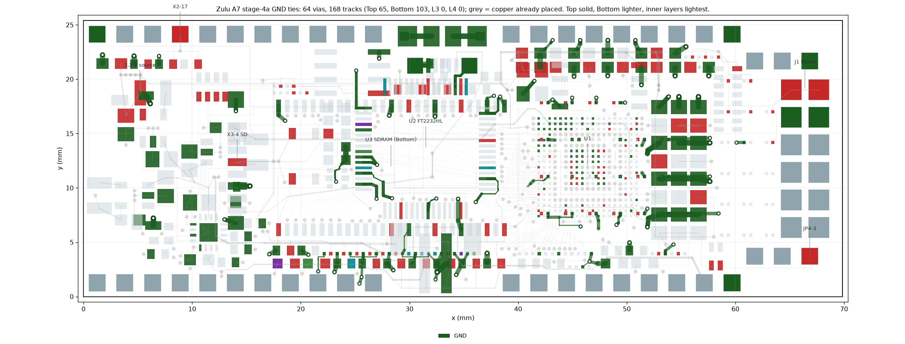

# Stage 4a: the GND ties — placed 2026-09-21

**Status: PLACED, SAVED, DRC-CLEAN ON EVERY GEOMETRIC RULE, VERIFIED FROM THE SAVED FILE. Three pads
remain untied and need a decision from you (below).**
`tools/stage4a/gen.py --check` rebuilds `tools/stage4a_route.json` (md5 f293dc12cd23bf0a34f97642080f5bed)
from the six region parts under `tools/stage4a/parts/`: **64 vias, 168 tracks, GND only**.
`PlaceStage4a` / `RemoveStage4a` in `tools/ZuluSetup.pas`. Picture: `tools/stage4/render.py`.



## What it does

Before this stage 103 of the board's 201 GND SMD pads had no path to the L2/L5 planes: the planes are
reached only through a via or a through-hole pad, and the fan-out, stage-1/2/3 and stitching work had
tied only 98. Each of the 103 now gets a tie — a short track from inside the pad to a new 0.20/0.35 via
(tented and Direct-connected by rule), to an existing GND via, or to a through-hole GND pad.

| Region | Pads | New vias | Notes |
|---|---|---|---|
| west | 8 | 8 | X3's shield pads and the header-corner caps; four vias under the SD socket body |
| south | 24 | 12 | the 0201/0603 cap row; two chains share doubled vias (v6+v6b, v3+v3b) |
| belly | 11 | 7 | U2's west/south/east GND pins and LD1-K/LD2-K; U2-10/11 share one via under U2's body |
| north | 11 | 6 | U3's north pads, U10, R86; U2-47 (Top) and U3-54 (Bottom) share one via |
| u1 | 29 | 17 | the 0201 rows and bulk caps around U1; four vias in the X2 pin gaps at y 23.6 |
| east | 20 | 14 | the 1206 array and the east pull-ups; three chains of three |

Ten longest ties: U3-12 7.40 mm, C142-2 5.47, C152-1 5.00, C143-2 4.68, C122-2 4.60, U2-35 4.51,
C109-2 4.26, U2-13 4.25, C5-1 4.20, C113-2 4.14 — every one of them via-site-limited (`corr.py` finds
no legal via cell nearer), with the cure in placement, not routing. 34 ties are under 1.0 mm, 19 in
1.0–1.5 mm, 47 over 1.5 mm.

## Three pads could not be tied

- **R13-2 and R15-1** (the XADC divider resistors at y 3.95). Each has exactly one exit, and it is the
  same 0.30 mm passage that ANALOG-IO1 (X2-40 → R14-2) and the NODE_P1 hop (R14-1 → R15-2 → R16-2)
  need: with the ties in, `route_reach` drops to 137/140 and `route_foreclosure` seals R14-1, R14-2 and
  R15-2. Two 3 mil tracks do not fit (2 × 0.0762 + 3 × 0.09 = 0.42 > 0.30).
  **Fix: move the AIN16_N via (43.30, 3.20) into the y 2.03–2.60 Bottom channel, or move C36/C37
  0.3 mm south.** Stage 4b needs this anyway — those signals already compete for the one lane. The tie
  geometry is kept in `parts/r_u1/gen.py` behind `TIE_R13_R15 = True`.
- **U2-5** (FT2232H GND pin, west side). `corr.py` finds **0 legal via cells** in x 24.0–28.6,
  y 14.4–16.0: the VCC1V0 Bottom trunk, CKE's L3 diagonal and FT-VPHY's Top column at x 24.8 box it in.
  The only chain (to U2-1) forecloses U2-2. **Fix: re-cut FT-VPHY's feed into U2-4, or move CKE's via
  (26.85, 15.60) ~0.3 mm east, or allow one via-in-pad.** That also gives the USB pair back the Top
  corridor at x 25.1–25.4.

## Gates (re-run by the main session on the plan, then on the saved board)

```
route_emit.py tools/stage4a_route.json Stage4a      clean; 67/67 joined
tools/stage4/gnd_check.py                            198/201 tied (U2-5, R13-2, R15-1 untied)
route_foreclosure.py                                 nothing foreclosed; 217 pads audited
route_reach.py                                       140 / 140
route_width.py USB_D_P / USB_D_N                     0.539 mm both (floor 0.45)
route_stitch.py                                      whole board 25462 (94.6 % of the stage-3 board)
board_preflight.py                                   clean; verify_widths.py PASS
```

Escape slots the ties cost: WE# (U1-V4) 7 → 4, FLASH-D01 (D19) 25+ → 22, D3 (W6) 25+ → 24; nothing
foreclosed. Stitching windows after: block 4769, north band 2028, U1 surround 1812, LED/X3 1291,
south bands 119 / 183, Bottom channel 45.

## Verification

- **DRC** (`docs/drc_stage4a_2026-09-21.drc`): **200 = 145 un-routed + 2 waived X2-20 thermals + 53
  antennae**; zero on every Clearance, Width, Short-Circuit, via, hole, mask and silk rule. Against
  stage 3 (300): 102 GND connections closed, **3 GND un-routed left** — exactly R13-2, R15-1 and U2-5.
- **Saved file**: `route_inputs.json` rebuilt from the PcbDoc is the pre-stage board plus the plan
  exactly — vias 267 → 331, tracks 1511 → 1679, no primitive missing or extra, every pad unchanged,
  every new via 0.20/0.35.

## Open, recorded rather than fixed

- Teardrops must skip the forced gaps: U2-35's 0.099 mm pinch, U2-13's 0.100 jog (×3), LD1-K
  0.101/0.101/0.105, U3-12's exit 0.101/0.102/0.102, R11-1 0.100, eleven 0.10-wide south row-gap
  segments, and the vias at (23.25,10.575) 0.091 to USB5V0, (36.1,8.7) 0.116 to BS0, (28.14,16.66)
  0.095 own pad, (51.35,19.475) 0.105 to U4-7, (45.75,6.45) 0.100 to VCC3V3.
- Chains through a neighbour's pad (no via site nearer): U3-12 → C152/C154/C6; C5-1 and C38-1 →
  C154/C6; C40/C41 → C7; C100-2 → C106-2; C134-1 → C139-1; LD2-K → LD1-K.
- Two ties were lengthened deliberately to give signal corridors room: L6-1 0.73 → 1.50 mm (frees the
  CHAN14–28 L3/L4 exit column at x 47.85–48.05) and C107-2 0.68 → 1.43 mm (frees the CFG-M0 / CHAN26
  stub ends at x 47.4). Both are one edit away in `parts/r_u1/gen.py` if you prefer the short ties.
- Placement items for the next spin: C122 east of x 57.4; C109/C113 and C119/C121 nearer a free via
  column; C140–C142 with a via each; C108 0.5 mm east. The FT-VCORE 100 nF row (C152–C154) and U3-12
  keep a 3.7–7.4 mm return — keep DRIVE 8 in the XDC.
- Via (46.575, 3.225) is 0.443 mm centre-to-centre from the AIN16_N via (rule 0.44) and now carries
  three pads; the mask-tenting rule must survive to the Gerbers.
- `tools/stage4a/gen.py` must be re-run with `--inputs` = the pre-stage `route_inputs.json`
  (commit a7aa623) now that the board is placed; `tools/stage4/segw.py` refuses the placed board.
