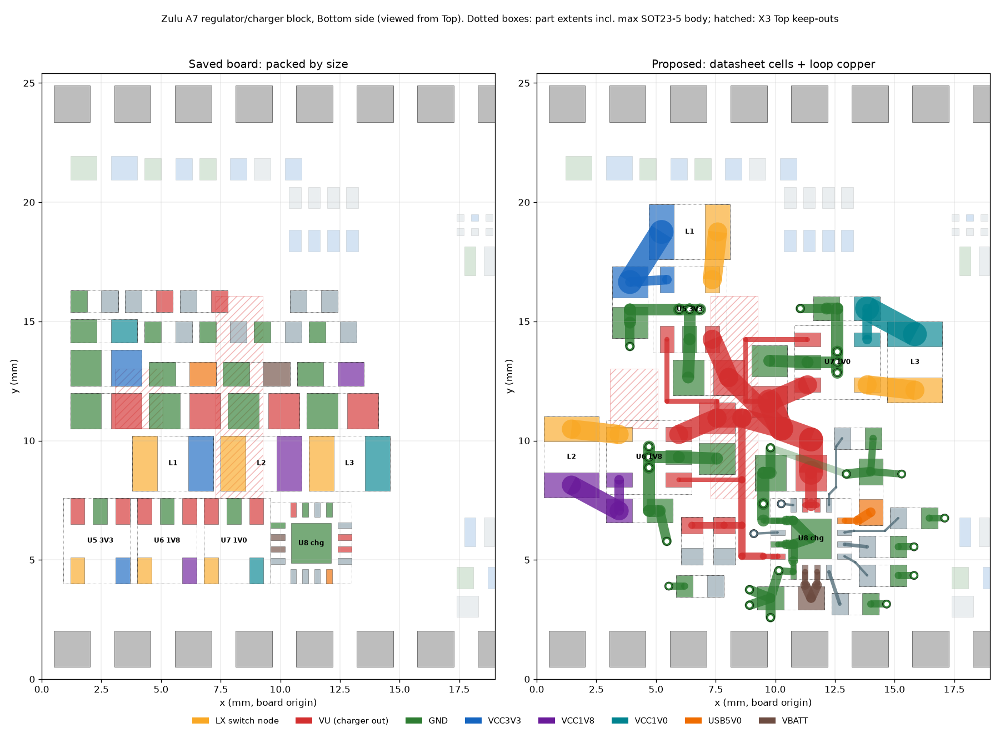

# Regulator / charger block: re-placement and loop copper, 2026-09-15

**Status: DESIGNED AND GATE-CHECKED, NOT PLACED. The placement change needs the user's go-ahead.**


Generator `tools/regblock_plan.py` → `tools/regblock_placement.json` (24 moves, one pad-net fix) and
`tools/regblock_route.json` (27 vias, 102 tracks). The checker is `tools/block_place.py`.

## Why the block had to move before its power feeds could be routed

All numbers below come from the saved PcbDoc (`tools/route_inputs.json`) and the two datasheets.

| Finding | Saved board | Requirement |
|---|---|---|
| SC189 LX pin to its inductor | pin 5 faces **away** from the inductor, behind its own VIN/GND/EN row (0.30 mm pin gaps); shortest Bottom routes 8.3 / 20.1 / 13.6 mm | SC189 p21 #2: LX traces as short as possible (2.5 MHz) |
| CIN to VIN (pad edge) | 3.10 / 3.31 / 3.58 mm | p21 #1: as close to VIN and GND as possible |
| COUT GND to IC GND | 4.70 / 6.97 / 8.48 mm | p21 #2: direct return to the GND pin |
| bq24232 IN / OUT / BAT caps | 8.98 / 4.43 / 6.23 mm | SLUS821J 11.1: as close as possible |
| U5/U6/U7 bodies | end to end with 0.30 mm pad gaps; the SOT23-5 body (p23, D 2.80–3.10) runs up to 0.30 mm past the end pads, so they touch at minimum D and overlap 0.30 mm at maximum | parts must not collide |
| R78 pad 1 | **no net** in every saved PcbDoc since 119e15b; the netlist says GND (VCC3V3–LD5–R78–GND). DRC cannot see a netless pad, so LD5 would never light | the netlist |

`tools/place_board.py` shelf-packed the PWR region by part size; the routing readiness review said
"the placement stands" without looking at the regulator loops.

## How the layout was chosen

Three independent layouts, each carrying its own loop copper and passing every gate: **row** (three
cells across the south), **column** (stacked down the west edge), **exits** (arranged around where
the currents enter and leave). Each was attacked by a power-integrity reviewer (SC189 p21 and
Figure 8, bq24232 11.1 and the pin table) and a manufacturing/routability reviewer. A judge chose
**exits** (review scores PI 7 / mfg 6 against 6 / 5 and 6.5 / 5) and repaired it:

- **row** lost on the X2 header: its VU trunk ran 0.103 mm from X2-34…39 for ~12 mm and the CIN
  pads sat 0.088 mm from the header's underside insulator; COUT's return went round the CIN
  (4.8 mm).
- **column** lost on bodies and a 25 mm VU spine along the board edge: R78/R106 over U3's TSOP
  body, C78's GND pad on the X2 insulator, the spine 0.25 mm from the edge and outside the plane
  pullback, and 0.1035 mm from L1's LX pad.
- **exits repairs** (in `regblock_plan.py`'s docstring): R1 COUT off the maximum SOT body (was
  0.002 mm); R2 L3 out from under U3's TSOP body (found by the judge alone); R3 bq24232 VSS pin 8
  grounded directly (it reached ground only through the thermal pad, which the pin table forbids);
  R4 a 0.14 mm GND spoke 0.093 mm from USB5V0 removed; R5 ILIM out from under C78; R6 a GND via
  0.55 mm from the thermal pad; R7 fine-pitch necks.
- Added afterwards (main session): **R8** the LD3_K / LD4_K cathode escape vias inside the EN2
  ring are placed now — the judge found those pockets routable only one net at a time and
  order-dependent.

## The layout

Everything is on Bottom except one 0.30 mm GND jumper on L4-SIG. The three SC189 cells use one
Figure 8 cell rotated to three orientations around a single VU node at (10.25, 10.50):

- **Cell:** CIN over pins 1–2, inductor over pins 5–4, COUT beside pins 3–4, each at the 0.30 mm
  land minimum. LX is one straight 0.80 mm track (2.01 mm). VIN is 0.80 mm and GND 0.50 mm. The
  sense track (0.40 mm) runs from pin 4 to the COUT pad, away from LX. A 0.50 mm GND channel under
  the body carries three plane vias from pin 2 to COUT GND, and a fourth sits at COUT.
- **Placement:**
  - U6 (1V8): rotated 270, inductor on the west edge.
  - U5 (3V3): rotated 180, inductor north.
  - U7 (1V0): rotated 90, inductor east, output facing U1.
- **bq24232:** U8 rotated 90 at (11.50, 5.90).
  - C78 VU pad over OUT 10/11 with its GND pad over the VSS corner; C151 under BAT 2/3;
    C150 beside IN 13.
  - R102–R106 at their pins.
  - GND: 8 vias on the thermal-pad island, and pin 8 has its own direct path.

| | LX-L | VIN-CIN | GND-CIN | L-COUT | COUT GND-IC GND | sense | GND vias |
|---|---|---|---|---|---|---|---|
| saved U5/U6/U7 | 3.44 / 4.03 / 4.72 | 3.10 / 3.31 / 3.58 | 2.90 | 2.87 / 2.58 / 10.32 | 4.70 / 6.97 / 8.48 | 3.72 / 4.37 / 5.09 | 0 |
| proposed (each) | 0.30 | 0.30 | 0.30 | 0.31 | 1.45 | 0.30 | 4 |

(pad-edge gaps, mm). bq24232: IN / OUT / BAT caps 0.30 mm each; R102–R106 0.30–2.05 mm.

## The gates (all pass on the committed files)

```
python tools/block_place.py tools/regblock_placement.json --plan tools/regblock_route.json --write-inputs M.json
python tools/route_emit.py tools/regblock_route.json RegLoops --inputs M.json
python tools/route_foreclosure.py --inputs M.json tools/regblock_route.json
python tools/block_place.py tools/regblock_placement.json --plan tools/regblock_route.json --write-inputs G.json --merge-plan
python tools/route_reach.py --inputs G.json
```

1. Legal placement: land gaps ≥ 0.30, edge ≥ 0.30, SOT23-5 max bodies. All 31 datasheet loop
   connections are made.
2. Geometry and connectivity check clean.
3. No U1 escape and no nearby pad foreclosed.
4. Merged-inputs file written: the plan copper added as board copper.
5. **323 / 323** un-routed connections still routable, the block's own power nets included.

The judge's extra checks (`work/judge.py` in the run): no maximum-tolerance body within 0.10 mm of
another body or 0.15 mm of a foreign pad, including U3's TSOP body and the X2 underside insulator.
Nothing in the plan is under 0.12 mm to foreign copper. GND tracks ≤ 0.50 mm.

Exits, at real widths, from a width-aware raster:

| Net | Route | Max width (mm) |
|---|---|---|
| VU | → X2-22 | 1.588 (1.225 on Bottom only) |
| USB5V0 | ← X1-1 | 0.725 |
| VBATT | ← X4-1 | 1.00 |
| VCC3V3 / VCC1V8 / VCC1V0 | → X2-17/18/19 | 1.588 |
| VCC1V0 | → U1, via L3+L4 in parallel through the north band | 1.588 on L3 |

## Open decisions and residual risks

- **Thermal: via-in-pad under U8's thermal pad.** The no-via-in-pad rule leaves the nearest plane via
  land 0.55 mm from the pad; the charger dissipates 0.36–0.61 W. JLC's resin-filled, capped
  via-in-pad (e.g. 4 × 0.20/0.35) would restore the datasheet's thermal model. This is the user's call.
- L2's pads are 0.302 mm from the west edge, inside the 0.508 mm plane pullback. Keep panel rails
  and V-scores off x = 0 for y 6.5–11.5.
- C150's GND joins U8's copper through its plane vias plus an L4 jumper. Electrically that is the
  plane return; it is not a surface trace.
- U5/U6/U7 at three rotations on Bottom: check the CPL rotations, and put pin-1 marks and the Z/L/A
  variants on the assembly drawing. The 0.30 mm gaps leave no room for designators.
- Later stages: keep non-GND vias ≥ 1 mm from the three LX nodes (U7/L3 sit under X3's SD contacts,
  shielded by L2/L5).

## To place (after approval)

`PlaceRegBlock` (moves + R78-1 → GND) → DRC → save → verify the saved pads and R78-1's net →
`route_inputs.py` → `route_emit.py tools/regblock_route.json RegLoops --require-complete`-style
check against the real board → `PlaceRegLoops` → DRC → save → verify → commit.
`RestoreRegBlock` undoes the moves (it leaves R78-1 on GND).
